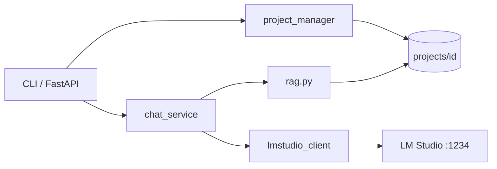

# Prompter

Local **project assistant** inspired by Claude Projects: persistent instructions, ingested project files, per-thread chat history, and retrieval-augmented prompts — all backed by **LM Studio** on your machine (no cloud APIs).

---

## Quick start (setup)

Follow these steps once. After that, use the [Creating a project](#creating-a-project) workflow and [CLI](#cli-usage) for day-to-day use.

### 1. Install LM Studio and load a model

1. Install [LM Studio](https://lmstudio.ai/).
2. Download and **load** a chat model (default in this app: **`gemma-4-e4b-it`**).
3. Start the **local server** (Developer / Local Server) on port **1234** (default).
4. Note the **exact model id** shown in LM Studio (e.g. `google/gemma-4-e4b-it`). You may need to put that in `.env` if health checks fail.

The app talks to LM Studio at `http://localhost:1234`. Nothing is sent to the cloud.

### 2. Install Python

You need **Python 3.11 or newer**.

```bash
python --version
```

### 3. Clone or open this repo

```bash
cd c:\Users\john\Documents\Programming\Tools\Prompter
```

(Use your actual path if different.)

### 4. Create a virtual environment and install Prompter

**Option A — uv (recommended if you use uv)**

```bash
uv venv
# Windows (Cmd)
.venv\Scripts\activate
# Windows (Git Bash) / macOS / Linux
source .venv/Scripts/activate

uv pip install -e ".[dev]"
```

**Option B — pip**

```bash
python -m venv .venv

# Windows (Cmd)
.venv\Scripts\activate

# Windows (Git Bash)
source .venv/Scripts/activate

pip install -e ".[dev]"
```

This installs the `app` package in editable mode plus dev tools (`pytest`).

### 5. Configure environment variables

Copy the example env file and edit if needed:

```bash
# Git Bash / macOS / Linux
cp .env.example .env

# Windows Cmd
copy .env.example .env
```

| Variable | Default | What it does |
|----------|---------|----------------|
| `LMSTUDIO_MODE` | `llm` | `llm` = native LM Studio API (`/api/v1/*`). `rest` = OpenAI-compatible (`/v1/chat/completions`). |
| `LMSTUDIO_BASE_URL` | `http://localhost:1234` | LM Studio server URL |
| `LMSTUDIO_MODEL` | `gemma-4-e4b-it` | Model name or suffix to match loaded model |
| `LMSTUDIO_API_TOKEN` | *(empty)* | Bearer token if LM Studio auth is enabled |
| `LMSTUDIO_VISION_MODEL` | *(empty)* | Optional vision model for image paste; defaults to `LMSTUDIO_MODEL` |
| `LMSTUDIO_SUPPORTS_VISION` | `auto` | `auto`, `true`, or `false` — whether Ctrl+V images go to multimodal API |
| `PROMPTER_PASTE_DEBUG` | *(empty)* | Set `1` to log clipboard/paste branches on stderr |
| `PROJECTS_DIR` | `./projects` | Root folder for all projects (filesystem-first) |
| `DATA_DIR` | `./data` | Temp uploads; legacy projects may still live under `data/projects/` |
| `DEBUG_PROMPTS` | `false` | Set `true` to print assembled prompts to stderr |

**Common fix:** if health check says the model is not loaded, set `LMSTUDIO_MODEL` to the exact id from LM Studio, for example:

```env
LMSTUDIO_MODEL=google/gemma-4-e4b-it
```

**Switch to REST fallback** (OpenAI-compatible endpoint):

```env
LMSTUDIO_MODE=rest
```

### 6. Verify LM Studio connection

With LM Studio running and the model loaded:

```bash
python -m app.main health
```

You want `ok=True` and `model_loaded=True`. If not:

| Symptom | What to try |
|---------|-------------|
| Connection refused | Start LM Studio local server on port 1234 |
| Model not loaded | Load the model in LM Studio before chatting |
| Wrong model name | Set `LMSTUDIO_MODEL` to the exact loaded id |
| Native API issues | Set `LMSTUDIO_MODE=rest` in `.env` |

### 7. Try the sample project (optional)

A sample project ships at `projects\sample-project\` (Windows) or `projects/sample-project/` (Git Bash):

```bash
python -m app.main show-project sample-project
python -m app.main chat sample-project
```

In chat, compose a message (see [Chat tips](#chat-tips)), then send with **Alt+Enter** (Escape, then Enter) or **Ctrl+J**. Leave with `/exit` or `/quit`.

### 8. Run tests (optional)

```bash
pytest
```

---

## Creating a project

Prompter is **filesystem-first**: each project is a normal folder you can create, edit, and drop files into.

### Simple workflow

1. **Scaffold a project**

   ```bash
   python -m app.main init "My Research"
   ```

   Creates `projects\my-research\` on Windows (or `projects/my-research/` elsewhere).

2. **Set instructions** — open `projects\my-research\instructions.md` in any editor and write how the assistant should behave. This file is the system prompt (reloaded on every chat and sync).

3. **Add documents** — copy or drag `.txt`, `.md`, or `.pdf` files into:

   ```
   projects\my-research\docs\
   ```

4. **Chat** — syncs `docs/` automatically, then talks to LM Studio:

   ```bash
   python -m app.main chat my-research
   ```

Optional: run `python -m app.main sync my-research` to ingest without chatting.

### Project folder layout

```
projects/
  my-research/
    project.yaml          # name, id, created (minimal metadata)
    instructions.md       # system prompt — edit this file
    docs/                 # your files (drag-and-drop here)
    .prompter/            # app-managed (ignore)
      chunks.json         # search index for RAG
      threads/            # chat history per thread
```

The `.prompter/` folder is internal — you do not need to edit it. Chunks and threads are created automatically.

You can also create a project manually: make `projects\my-folder\`, add `instructions.md` and a `docs/` folder, then run `sync` or `chat`.

### Migrating from `data/projects/`

Older installs stored projects under `data\projects\`. Prompter still **auto-detects** that location if `./projects` is empty but `data/projects` has content.

To migrate explicitly:

1. Copy each project folder from `data\projects\{id}\` to `projects\{id}\`.
2. Rename `metadata.yaml` → `project.yaml`, move `system_prompt` text into `instructions.md`.
3. Rename `files\` → `docs\`, move `chunks.json` and `threads\` under `.prompter\`.

Opening a legacy project via `show-project` or `chat` can perform parts of this upgrade automatically.

---

## CLI usage

All commands run from the repo root with the venv activated.

```bash
# Scaffold a new project (preferred)
python -m app.main init "My Research"

# Ingest docs/ (optional; chat also syncs)
python -m app.main sync my-research

# List and inspect projects
python -m app.main list-projects
python -m app.main show-project my-research

# Copy a single file into docs/ and ingest (convenience)
python -m app.main add-file my-research .\path\to\notes.pdf

# New conversation thread
python -m app.main new-thread my-research --title planning

# Interactive chat (syncs docs/ first)
python -m app.main chat my-research
python -m app.main chat claude-prompter
python -m app.main chat "Claude Prompter"
python -m app.main chat Claude Prompter
python -m app.main chat my-research --thread-id <thread_id>
```

`create-project` still works but is **deprecated** — use `init` instead.

Project ids are slugs from the name (e.g. `My Research` → `my-research`). You can pass the slug, a quoted display name, or multiple words without quotes (`chat Claude Prompter`). Use `list-projects` / `show-project` for the exact id.

### Chat input (Ctrl+V workflow)

Interactive chat uses **prompt_toolkit** when stdin is a TTY (PowerShell, Git Bash, Cmd). **Ctrl+V reads the OS clipboard first** (not only what the terminal injects), so large pastes work in classic PowerShell as well as Windows Terminal.

| Action | How |
|--------|-----|
| New line while composing | **Enter** |
| Send message | **Alt+Enter** (Escape, then Enter) or **Ctrl+J** |
| Paste (smart) | **Ctrl+V** — image → `[Image #N]`; copied files → `[File: name.pdf]`; long text → `[Pasted text #N +X lines]` |
| Expand collapsed paste | **Ctrl+V** again while the cursor is on the placeholder |
| Quit | `/exit` or `/quit` |
| Paste fallback | `/paste`, paste, then `.send` on its own line |
| Long edit in your editor | `/edit` (uses `$EDITOR`; default **notepad** on Windows) |
| Send a file as the message | `/file path\to\notes.md` |

**Collapse thresholds:** 2+ lines or 150+ characters. Example: a 4-line paste in PowerShell shows `helo [Pasted text #1 +3 lines]` with a gray **paste again to expand** toolbar hint. **Alt+Enter** or **Ctrl+J** sends the full text (and any attached images), not the placeholder.

**Windows:** Install optional clipboard support for images and file lists:

```bash
pip install -e ".[windows]"
```

Uses **Pillow** + **pywin32** (`CF_HDROP`, `ImageGrab`). Text-only fallback uses **pyperclip** if win32 is unavailable.

**Vision models:** With a vision-capable model loaded in LM Studio, set for example:

```env
LMSTUDIO_VISION_MODEL=your-vision-model-id
LMSTUDIO_SUPPORTS_VISION=true
```

Images pasted with Ctrl+V are sent as multimodal `input` to `/api/v1/chat`. On a **text-only** model (default `gemma-4-e4b-it`), images are copied into `docs/`, synced for RAG, and you get a short notice to load a vision model for direct image Q&A.

**Debugging paste:** `PROMPTER_PASTE_DEBUG=1` logs branches such as `ctrl_v: branch=text`, `ctrl_v_clipboard`, `burst_feed`, `bracketed`.

**Git Bash / WSL:** Same keys; if multiline keys misbehave, set `PROMPTER_SIMPLE_INPUT=1` for single-line `you>` input (slash commands still work).

**Huge content:** Drop files in `docs/` and `sync`, or use `/file projects\my-research\docs\notes.md`.

---

## API server

Start the HTTP API:

```bash
uvicorn app.main:app --reload --host 127.0.0.1 --port 8000
```

Open `http://127.0.0.1:8000/docs` for interactive Swagger UI.

| Method | Path | Purpose |
|--------|------|---------|
| GET | `/health` | LM Studio + model status |
| POST | `/projects` | Create project (writes `instructions.md`) |
| GET | `/projects` | List projects |
| GET | `/projects/{project_id}` | Project detail (`instructions_path`, `docs_path`) |
| POST | `/projects/{project_id}/files` | Upload into `docs/` and ingest |
| POST | `/projects/{project_id}/threads` | New thread |
| POST | `/projects/{project_id}/threads/{thread_id}/messages` | Send message (syncs `docs/` first) |

For day-to-day use, dropping files into `docs/` and using the CLI or API chat is enough — uploads are optional.

Examples:

```bash
curl http://127.0.0.1:8000/health

curl -X POST http://127.0.0.1:8000/projects \
  -H "Content-Type: application/json" \
  -d "{\"name\":\"API Demo\",\"system_prompt\":\"Be concise and helpful.\"}"
```

---

## How it works (short)

1. **Projects** live as folders under `PROJECTS_DIR` (default `./projects/{id}/`).
2. **Instructions** come from `instructions.md` in each project folder.
3. **Documents** in `docs/` are scanned on `sync` and before each chat message; only new or changed files are re-ingested (mtime + size).
4. On each **chat message**, relevant chunks are retrieved (lexical search in v1) and combined with instructions and thread history.
5. The assembled prompt is sent to **LM Studio** via the configured mode (`llm` or `rest`).

Set `DEBUG_PROMPTS=true` to see the full payload sent to the model.

### RAG (v1 vs future)

| Approach | Status | Notes |
|----------|--------|--------|
| Lexical scoring | **Used now** | Fast, offline, no embedding model |
| Persisted chunks | **Yes** | `.prompter/chunks.json` updated on ingest |
| Embeddings | **Not yet** | `rag.py` can be extended later |

---

## Architecture



## Web UI

Prompter includes a dark, LM Studio-inspired web interface with NotebookLM-style source management.

### One-click start (Windows)

Double-click **`Start Prompter.bat`** in the repo root.

What it does:
1. Creates a `.venv` if missing and installs dependencies
2. Builds the web UI if `web/dist/` is missing (requires Node.js)
3. Warns if LM Studio is not running (non-blocking)
4. Starts the server on `http://127.0.0.1:8000`
5. Opens your browser automatically

To pin to the desktop: right-click `Start Prompter.bat` → Send to → Desktop (create shortcut).

### Dev mode (hot-reload frontend)

```bash
# Terminal 1 — backend
python -m app.main serve --no-browser

# Terminal 2 — frontend with Vite HMR
cd web
npm install
npm run dev
# Opens at http://localhost:5173 with proxy to :8000
```

### Serve command

```bash
python -m app.main serve               # start server + open browser
python -m app.main serve --no-browser  # server only
python -m app.main serve --port 9000   # custom port
```

### Web UI layout

```
┌──────────────┬────────────────────────┬─────────────────┐
│ Projects     │ Chat                   │ Instructions    │
│              │                        │                 │
│ Sources ☑    │ messages…              │ [textarea]      │
│  □ file1     │                        │ [Save]          │
│  ☑ file2     │ [composer]             │                 │
│ [+ Add]      │ Using 2 sources        │ [⚙ Settings]   │
└──────────────┴────────────────────────┴─────────────────┘
│ LM Studio: gemma-4-e4b-it ● loaded                      │
└──────────────────────────────────────────────────────────┘
```

### Sources panel (NotebookLM-style)

- Each file in `docs/` gets a checkbox — only checked files feed the RAG retrieval
- **Add source**: click `+` or drag-and-drop `.txt`, `.md`, `.pdf` files
- **Sync** (↺): re-index changed files without re-uploading
- **Select All / None**: bulk enable/disable
- **Delete** (×): removes file and its index chunks
- A green `●` dot shows a file has been indexed; `○` means pending sync

Enabled sources are saved to `projects/{id}/.prompter/sources.json`. Empty list = all docs (backward compatible with the CLI).

### Settings modal (⚙)

Accessible from the bottom of the right panel. Sections:

| Section | Fields |
|---------|--------|
| LM Studio | Server URL, mode (llm/rest), model name, vision model, vision support |
| RAG | Top-K results, chunk size, chunk overlap |
| Advanced | Debug prompts toggle, projects directory (read-only) |

Settings are saved to `data/settings.local.json` and override `.env` values (except secrets like `LMSTUDIO_API_TOKEN` which stay in `.env`).

### Building the frontend manually

```bash
cd web
npm install
npm run build
# Output goes to web/dist/ — FastAPI serves it at /
```

---

## Repository layout

```
Prompter/
├── app/
│   ├── main.py              # CLI + FastAPI (all API endpoints)
│   ├── config.py            # Settings from .env
│   ├── settings_store.py    # Layered settings (local.json overlay)
│   ├── lmstudio_client.py   # llm + rest adapters
│   ├── project_manager.py   # Projects on disk + sources management
│   ├── rag.py               # Ingest + retrieve chunks (source filter)
│   ├── chat_service.py      # Prompt assembly + chat
│   ├── schemas.py           # Pydantic models (incl. Sources, Settings)
│   ├── terminal_input.py    # CLI chat input (multiline, Ctrl+V, UserTurn)
│   ├── clipboard_paste.py   # OS clipboard (text, image, file paths)
│   ├── message_parts.py     # UserTurn, attachments, resolve-on-send
│   ├── paste_input.py       # Paste placeholder registry
│   └── utils.py
├── web/                     # React + Vite frontend
│   ├── src/
│   │   ├── App.tsx          # 3-column layout
│   │   ├── api/client.ts    # Typed API client
│   │   ├── components/      # UI components
│   │   └── styles/theme.css # Dark theme CSS variables
│   ├── dist/                # Built output (served at /)
│   └── package.json
├── scripts/
│   └── start_prompter.py    # Cross-platform launcher
├── Start Prompter.bat        # Windows one-click launcher
├── projects/                # Your projects (filesystem-first)
│   └── sample-project/
├── data/
│   └── settings.local.json  # Web UI settings overrides
├── tests/
├── .env.example
├── pyproject.toml
└── README.md
```

## LM Studio integration notes

- **Primary (`LMSTUDIO_MODE=llm`)**: `GET /api/v1/models`, `POST /api/v1/chat`. See [LM Studio REST docs](https://lmstudio.ai/docs/developer/rest).
- **Fallback (`LMSTUDIO_MODE=rest`)**: `GET /v1/models`, `POST /v1/chat/completions` (OpenAI-compatible).
- Model matching is fuzzy by suffix (e.g. `gemma-4-e4b-it` can match `google/gemma-4-e4b-it`). Prefer an exact id in `.env` if health checks are flaky.

Adapter logic lives in `app/lmstudio_client.py` so you can adjust API details without rewriting the rest of the app.

## License

MIT (add a `LICENSE` file if you distribute this).
