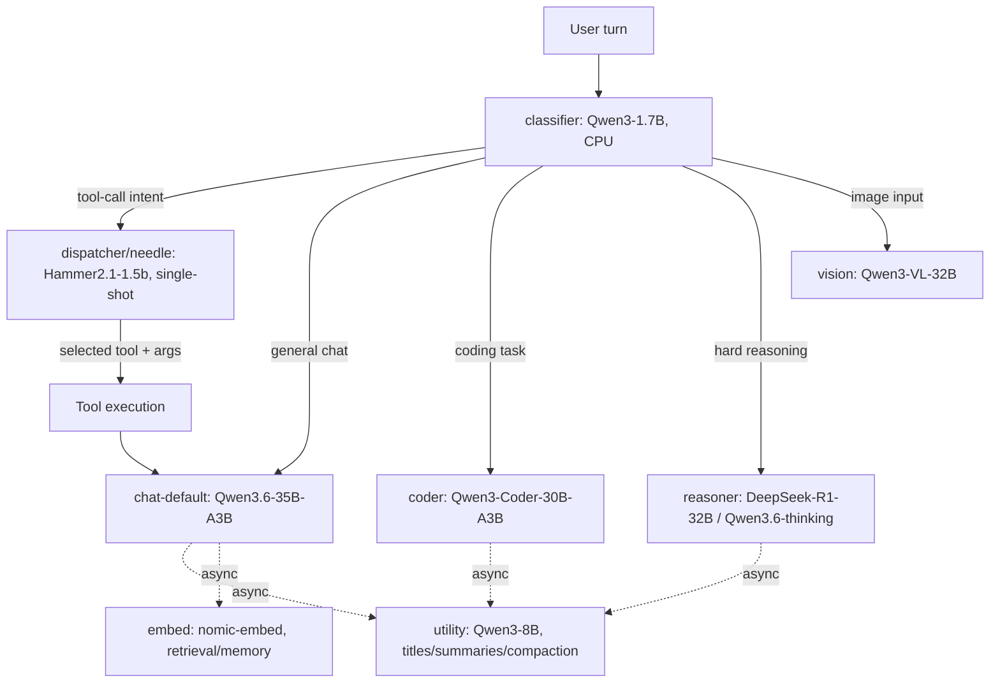

# Phase-0 / Phase-0.5 Findings — Condensed

Full detail and raw numbers: `docs/phase0-measurements.md` (section numbers
referenced below). This doc is the short version — one line per decision,
no repeated reasoning.

## 0. Glossary

- **classifier** — Qwen3-1.7B, CPU-resident router that classifies each user turn's intent to decide downstream routing (needs the non-thinking-mode fix confirmed before use).
- **utility** — Qwen3-8B Q4, background/non-streaming model for titles, summaries, compaction, memory review; tolerant of slow/CPU latency since nothing waits on it synchronously.
- **embed** — nomic-embed (v1.5 GPU / v2-moe CPU), batched embedding model for retrieval/memory.
- **dispatcher / needle** — originally scoped as Cactus-Needle-26M, in practice Hammer2.1-1.5b (with FunctionGemma-270M as a credible secondary candidate): a small, single-shot (never the full agent loop) tool-call dispatcher that picks a tool + arguments.
- **chat-default** — Qwen3.6-35B-A3B (MoE), the always-warm general-chat model with native tool calling.
- **coder** — Qwen3-Coder-30B-A3B (MoE); coder-small is Qwen2.5-Coder-7B, a fast fallback/parallel coding lane.
- **reasoner** — DeepSeek-R1-Distill-Qwen-32B and/or Qwen3.6-35B-A3B-thinking (dual pick, no single winner), for deliberate multi-step reasoning with visible chain-of-thought.
- **vision** — Qwen3-VL-32B (+ mmproj), the vision-language model for image understanding.

**Clarifying note on `utility`+CPU:** the isolated Phase-0 benchmark found CPU `utility` "fails hard" (3.3 tok/s, worst-case synthetic 128-token forced generation), while the later Phase-0.5 concurrent test found it acceptable under real concurrent conditions with a real transcript (17.6-21.8s, a background job nobody waits on synchronously). Both are correct; the Config B verdict (CPU-resident `utility`+`embed`) rests on the concurrent number, not the isolated one — see `docs/phase0-measurements.md` §5/§8 for the raw numbers.

## 0.1 How the locked-roster candidates interact at runtime

- `classifier` is the single entry point on every turn, always on CPU.
- `dispatcher`/`needle` only ever makes one single-shot tool-call decision — never a persistent agent loop; the tool result flows back into whichever main model is active for the actual response.
- `chat-default`/`coder`/`reasoner`/`vision` are mutually exclusive per-turn destinations (one big model active at a time on the GPU0 slot), not concurrent.
- `utility` and `embed` are drawn with dashed/async edges because they run in the background (titles, summaries, compaction, memory retrieval) and are never on a turn's synchronous critical path.

## 1. Locked roster

| Slot | Pick | Why (one line) | Detail |
|---|---|---|---|
| Vector store | Qdrant | sqlite-vec p95 105ms vs. 50ms bar | §6 |
| Coder quant | Q5_K_M | clears ≥100 tok/s bar, better quality than Q4, Q6 needs +3GB for marginal gain | §2, §9 |
| Reasoner | DeepSeek-R1-Distill-Qwen-32B **and** Qwen3.6-35B-A3B thinking — no single winner | both 7/7 correct on reasoning prompts at a proper token budget; B more reliable on debug-diagnosis (5/6 vs A's 3/6, A hallucinated 2 wrong fixes) | §9 |
| Vision | Qwen3-VL-32B | 6/6 correct vs Gemma-3-27b-it's 5/6 (missed a dot-count) | §9 |
| Classifier | Qwen3-1.7B-Q8_0 + `/no_think` suffix | thinking mode burned its budget with no suffix; fixed with a prompt-level fix, no template change | §2 |
| Embed | nomic-embed-text (v1.5 GPU / v2-moe CPU) | GPU-resident ~5x faster for ~70MB VRAM; CPU fine as fallback | §8 |
| Dispatcher | Hammer2.1-1.5b | 79.0% call_f1 prompt-tuned, 100% parse, 0.10s/call | §2 |
| Title generation | Hammer2.1-1.5b | 760x faster and more accurate than CPU-resident utility (which hits the same thinking-budget trap as reasoners) | §12 |
| `utility`+`embed` placement | CPU (Config B) | background-only framing holds: 18-22s real summary latency is fine async; GPU-resident would cost Hammer 5-7x dispatcher latency for ~370MB headroom | §5, §8 |
| Big-model GPU pinning | `CUDA_VISIBLE_DEVICES` solo-GPU0, not tensor-split | tensor-split-3,1 is ~3x slower and structurally OOMs `utility` on GPU1 | §8 |
| FunctionGemma-270M | Not adopted (secondary candidate only) | full-250 finetune: 88.3% call_f1 on a fresh holdout, beats Hammer's number, but higher per-call latency (0.29-0.34s vs 0.10s) — Hammer's track record wins for now | §10 |
| KV-cache quant | Low priority | Q8_0 only recovers ~250MB at 32k ctx for this MoE model (GQA keeps KV small) | §11 |
| Needle / Cactus | Dropped | see below | §2 |

## 2. Needle / Cactus — dropped

Needle 26M failed on both latency (~0.9-1.1s/call vs. a 50ms bar) and,
after finetuning, generalization (100% held-out score came from a
limited-template training set). Cactus's production runtime that would fix
the latency can't build on x86_64 at all (hard-locked to ARM NEON
intrinsics) — dropped in favor of Hammer2.1-1.5b and FunctionGemma-270M.

## 3. Open action items

- **Swap latency (§4, never scripted)** — needs `llama-swap` actually
  running with `serving/llama-swap/config.yaml` regenerated against
  current blob paths.
- **Stale `granite4:3b`/`granite4-3b-longctx` llama-swap entries** point at
  a missing blob (`sha256-6c02683...`) — not fixed, out of scope so far.
- **`settings.json`/`app/config.py` empty `ollama_model_names` entries** —
  confirmed live bug (~3s tax per LLM iteration on affected routes,
  compounds to 10s+ on multi-step tool calls). Root cause confirmed, fix
  not yet applied.
- **`llama-server.service` (systemd)** — was auto-respawning a leftover
  test server stealing ~10GB VRAM; stopped this session but not disabled —
  decide if it should be `disable`d at boot.

## 4. Future tests / follow-ups (Test 7+ round — harness built, awaiting a real GPU run)

Scripts/eval data for all of these now exist (this round's deliverable); none
have been run against real models/hardware yet from this session (no network
path to the box). See the plan file for full design detail per item.

- **Dynamic util-load-on-demand** (`scripts/bench_swap_latency.py`): keep
  `utility` CPU-resident by default, hot-load it onto GPU only when a tool
  call actually needs it. Blocked on regenerating the stale
  `serving/llama-swap/config.yaml` on the box first (authorized, not yet
  done).
- **Hammer title-format cleanup** (`scripts/postprocess_title.py` +
  `--postprocess` flag on `eval_title_gen.py`): deterministic fence/quote/
  trailing-punct strip, unit-tested 12/12 against
  `scripts/eval_data/title_cleanup_cases.json`; run against **both**
  Hammer2.1-1.5b and FunctionGemma-270M.
- **Context-depth degradation** (`scripts/bench_context_depth.py` +
  `scripts/eval_data/context_depth_transcript.json`): does quality/speed
  hold up as a real conversation fills toward 32k, checkpointed at
  2k/8k/16k/24k/32k with a recall probe.
- **Max practical context ceiling** (same script, pushed past 32k): finds
  the real usable ceiling per big model where tok/s stays ≥15 and the
  recall probe still passes — not chasing frontier-hosted-model context
  sizes, just the honest max for this hardware.
- **Embedding retrieval quality** (`scripts/eval_embed_retrieval.py` +
  `embed_corpus.json`/`embed_retrieval_set.json`, 30 labeled queries / 20
  docs): recall@1/5/10, proposed bar recall@5 ≥ 0.85.
- **Classifier broader accuracy pass** (`scripts/eval_classifier_accuracy.py`
  + `classifier_intents.json`, ~88 examples across 6 categories incl.
  ambiguous cases): blocked on the classifier's thinking-mode fix being
  confirmed live first.
- **JSON/structured-output reliability** (`scripts/eval_structured_output.py`
  + `structured_output_prompts.json`, 10 schema shapes): hand-rolled
  validator, no new dependency added.
- **Harder tool-registry stress test**
  (`scripts/needle_training/gen_stress_data.py` generates
  `data_stress.jsonl`, 82 examples across a 13-tool overlapping-name
  registry; `scripts/needle_training/eval_tool_stress.py` scores it): run
  against **both** Hammer2.1-1.5b and FunctionGemma-270M, reported as an F1
  delta vs. the narrow 6-tool baseline.

Still open, not yet designed:
- **A debug panel / dev-tool surface** for manually triggering and
  comparing dispatcher candidates against live traffic — functionality gap,
  not yet built.
- **Multi-slot concurrent-user throughput** (`--parallel N`) — no test yet
  covers 2-3 simultaneous users hitting one chat-default server.
- **Sustained-load thermal/throttle check** — all benches so far are short
  bursts; a 10-15 min continuous run would catch clock-throttling.

## 5. Harness (reusable, no changes needed)

`scripts/bench_models.sh`, `bench_server.py`, `bench_concurrent.py`,
`bench_needle.py`, `bench_sqlitevec.py`, `run_benchmark_suite.sh`,
`download_models.sh`, `eval_quality_transcripts.py`, `eval_coder_compile.py`,
`eval_title_gen.py`, `needle_training/*` — all working, all logs under
`logs/benchmarks/`.

## 6. Process/hygiene notes

- One GPU job at a time, except deliberate concurrency tests (§8).
- Pin big models to a single GPU via `CUDA_VISIBLE_DEVICES`, not a
  degenerate `--tensor-split` — the latter is ~3x slower (§8).
- Thinking-mode models need a real token budget (4096+) before judging
  quality — an under-budgeted eval measures truncation, not correctness (§9).
- `timeout <N> cmd`: capture `$?` immediately after the command, not inside
  an `if !cmd; then RC=$?; fi` block (real bug hit in `bench_models.sh`).
- No background agents idle-watching downloads/benchmarks — use direct
  bounded waits instead.
