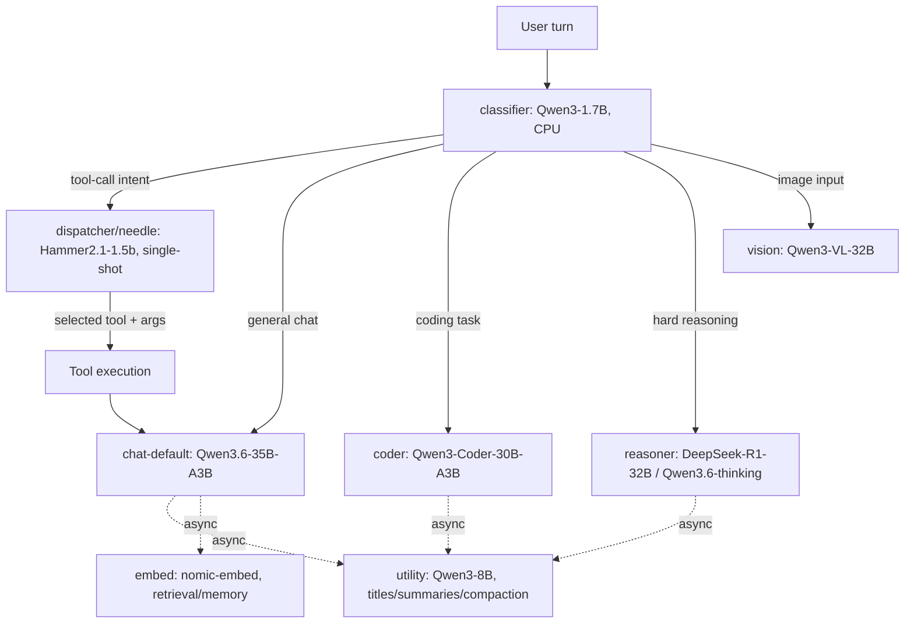

# Phase-0 / Phase-0.5 Findings — Condensed

Full detail and raw numbers: `docs/phase0-measurements.md` (section numbers
referenced below). This doc is the short version — one line per decision,
no repeated reasoning.

## 0. Glossary

- **classifier** — Qwen3-1.7B, CPU-resident router that classifies each user turn's intent to decide downstream routing (needs the non-thinking-mode fix confirmed before use).
- **utility** — Qwen3-8B Q4, background/non-streaming model for titles, summaries, compaction, memory review; tolerant of slow/CPU latency since nothing waits on it synchronously.
- **embed** — nomic-embed (v1.5 GPU / v2-moe CPU), batched embedding model for retrieval/memory.
- **dispatcher / needle** — originally scoped as Cactus-Needle-26M, in practice Hammer2.1-1.5b (with FunctionGemma-270M as a credible secondary candidate): a small, single-shot (never the full agent loop) tool-call dispatcher that picks a tool + arguments.
- **chat-default** — Qwen3.6-35B-A3B (MoE), the always-warm general-chat model with native tool calling.
- **coder** — Qwen3-Coder-30B-A3B (MoE); coder-small is Qwen2.5-Coder-7B, a fast fallback/parallel coding lane.
- **reasoner** — DeepSeek-R1-Distill-Qwen-32B and/or Qwen3.6-35B-A3B-thinking (dual pick, no single winner), for deliberate multi-step reasoning with visible chain-of-thought.
- **vision** — Qwen3-VL-32B (+ mmproj), the vision-language model for image understanding.

**Clarifying note on `utility`+CPU:** the isolated Phase-0 benchmark found CPU `utility` "fails hard" (3.3 tok/s, worst-case synthetic 128-token forced generation), while the later Phase-0.5 concurrent test found it acceptable under real concurrent conditions with a real transcript (17.6-21.8s, a background job nobody waits on synchronously). Both are correct; the Config B verdict (CPU-resident `utility`+`embed`) rests on the concurrent number, not the isolated one — see `docs/phase0-measurements.md` §5/§8 for the raw numbers.

## 0.1 How the locked-roster candidates interact at runtime

- `classifier` is the single entry point on every turn, always on CPU.
- `dispatcher`/`needle` only ever makes one single-shot tool-call decision — never a persistent agent loop; the tool result flows back into whichever main model is active for the actual response.
- `chat-default`/`coder`/`reasoner`/`vision` are mutually exclusive per-turn destinations (one big model active at a time on the GPU0 slot), not concurrent.
- `utility` and `embed` are drawn with dashed/async edges because they run in the background (titles, summaries, compaction, memory retrieval) and are never on a turn's synchronous critical path.

## 1. Locked roster

| Slot | Pick | Why (one line) | Detail |
|---|---|---|---|
| Vector store | Qdrant | sqlite-vec p95 105ms vs. 50ms bar | §6 |
| Coder quant | Q5_K_M | clears ≥100 tok/s bar, better quality than Q4, Q6 needs +3GB for marginal gain | §2, §9 |
| Reasoner | DeepSeek-R1-Distill-Qwen-32B **and** Qwen3.6-35B-A3B thinking — no single winner | both 7/7 correct on reasoning prompts at a proper token budget; B more reliable on debug-diagnosis (5/6 vs A's 3/6, A hallucinated 2 wrong fixes) | §9 |
| Vision | Qwen3-VL-32B | 6/6 correct vs Gemma-3-27b-it's 5/6 (missed a dot-count) | §9 |
| Classifier | Qwen3-1.7B-Q8_0 + `--reasoning off` + few-shot prompt | 91.76% on the real 6-category taxonomy (up from a badly-broken 45.88% — see §14 for the extraction-bug fix, few-shot prompt, and why `--reasoning off` replaced the unreliable `/no_think` text suffix) | §2, §14 |
| Embed | nomic-embed-text (v1.5 GPU / v2-moe CPU) | GPU-resident ~5x faster for ~70MB VRAM; CPU fine as fallback | §8 |
| Dispatcher | Hammer2.1-1.5b | 79.0% call_f1 prompt-tuned, 100% parse, 0.10s/call | §2 |
| Title generation | Hammer2.1-1.5b | 760x faster and more accurate than CPU-resident utility (which hits the same thinking-budget trap as reasoners) | §12 |
| `utility`+`embed` placement | CPU (Config B) | background-only framing holds: 18-22s real summary latency is fine async; GPU-resident would cost Hammer 5-7x dispatcher latency for ~370MB headroom | §5, §8 |
| Big-model GPU pinning | `CUDA_VISIBLE_DEVICES` solo-GPU0, not tensor-split | tensor-split-3,1 is ~3x slower and structurally OOMs `utility` on GPU1 | §8 |
| FunctionGemma-270M | Not adopted (secondary candidate only) | full-250 finetune: 88.3% call_f1 on a fresh holdout, beats Hammer's number, but higher per-call latency (0.29-0.34s vs 0.10s) — Hammer's track record wins for now | §10 |
| KV-cache quant | Low priority | Q8_0 only recovers ~250MB at 32k ctx for this MoE model (GQA keeps KV small) | §11 |
| Needle / Cactus | Dropped | see below | §2 |

## 2. Needle / Cactus — dropped

Needle 26M failed on both latency (~0.9-1.1s/call vs. a 50ms bar) and,
after finetuning, generalization (100% held-out score came from a
limited-template training set). Cactus's production runtime that would fix
the latency can't build on x86_64 at all (hard-locked to ARM NEON
intrinsics) — dropped in favor of Hammer2.1-1.5b and FunctionGemma-270M.

## 3. Open action items

- **Swap latency (§4, never scripted)** — needs `llama-swap` actually
  running with `serving/llama-swap/config.yaml` regenerated against
  current blob paths.
- **Stale `granite4:3b`/`granite4-3b-longctx` llama-swap entries** point at
  a missing blob (`sha256-6c02683...`) — not fixed, out of scope so far.
- **`settings.json`/`app/config.py` empty `ollama_model_names` entries** —
  confirmed live bug (~3s tax per LLM iteration on affected routes,
  compounds to 10s+ on multi-step tool calls). Root cause confirmed, fix
  not yet applied.
- **`llama-server.service` (systemd)** — was auto-respawning a leftover
  test server stealing ~10GB VRAM; stopped this session but not disabled —
  decide if it should be `disable`d at boot.

## 4. Test 7+ — final results (see `docs/phase0-measurements.md` §13 for full detail, §16 for the bug-fix history)

The first pass at these tests ran with genuinely weak harnesses (bare-list
prompts, a scoring bug, an unreliable thinking-suppression convention,
too-small token budgets). Two further rounds of fixes found the real root
causes — see §5 below and `docs/phase0-measurements.md` §16 for the full
lessons-learned writeup, now also codified in
`.cursor/rules/010-benchmark-eval-methodology.mdc`. Only final numbers kept
here:

- **Classifier accuracy**: **91.76%** overall on Qwen3-1.7B (6 real routing
  categories) — clears the ≥90% bar with a scoring-bug fix + few-shot prompt
  + `--reasoning off`, no bigger model required. A same-prompt comparison
  against `qwen3-4b` (already on disk) answered "would a bigger model help"
  decisively: **no** — that specific gguf never honors reasoning-suppression
  flags and costs ~93.7s/call vs. the 1.7B's 0.283s/item. Stay on the fixed
  1.7B.
- **Hammer tool-registry stress** (13-tool overlapping registry): **63.75%
  call_f1** after few-shot disambiguation examples for the actual confusable
  tool-name trios. Residual errors are argument-fidelity only (dropping
  "the"/"a" when copying query text into an argument), not wrong-tool
  selection. A tool-retrieval pre-filter (embed-based top-k candidate
  narrowing — the standard "tool-RAG" pattern) was tried and **did not
  help** (60.87%/59.26% at top-k 5/8, both below the unfiltered number) —
  retrieval itself misses the correct tool 5-9% of the time, and the
  few-shot prompt already handled most of the real disambiguation. Honest
  negative result, not adopted.
- **FunctionGemma-270M tool-registry stress, fair harness**: **36.5%
  call_f1** via its native chat-template harness + finetuned checkpoint.
  First fair head-to-head: Hammer 63.75% vs. FunctionGemma 36.5% — Hammer
  stays the better dispatcher under registry pressure.
- **Hammer title generation**: **8/8 rubric-pass** after (a) few-shot
  examples in the prompt and (b) fixing the rubric itself — the original
  5-8-word range punished a model for being short with no recovery path;
  real title-gen truncates long output in code and never penalizes short
  output, so `clean_title()` now truncates instead of failing and the
  rubric drops the minimum.
- **Structured JSON output (chat-default)**: **100% parse, 100%
  schema-valid** with `--reasoning off` — the earlier failures were
  thinking-mode truncation, not a nested/array JSON weakness. Latency also
  dropped from ~6-10s to under 1s per request.
- **Context-depth degradation (chat-default, `--reasoning off`)**: recall
  probe is **correct at every checkpoint from 2k through 32k** — an earlier
  "empty past 2k" result was purely the thinking-mode trap contaminating
  the measurement. The honest tok/s degradation is **52.9% by 32k** — a
  real, confirmed fail of the ≤30% bar. This model's context-depth problem
  is a throughput problem only, not an accuracy one.
- **Dynamic util-load-on-demand**: `serving/llama-swap/config.yaml` was
  regenerated from scratch against the actual locked roster (one entry per
  routing alias, current model paths, `coder` on the locked Q5_K_M quant,
  solo-GPU0 `CUDA_VISIBLE_DEVICES` placement instead of the §8-rejected
  tensor-split, `classifier`/`utility`/`embed` CPU-resident with `ttl: 0`).
  Real swap-latency numbers: **utility (CPU) cold 20.54s / warm ~9.1-9.4s**,
  **needle/Hammer (GPU0) cold 3.48s / warm 0.03-0.18s**, **chat-default
  (GPU0) cold 12.47s / warm 0.67s**.

**On the dispatcher's actual job (per PLAN.md §4.7):** Needle/Hammer was
never designed as the primary or sole tool-calling mechanism — the primary
path is the main model's own native tool calling; the dispatcher only ever
assists the call-emission step for models tagged `tool_call: weak`, and the
plan is explicit that "Needle is the dispatcher, never the planner." A
mediocre dispatcher score on a deliberately hard 13-tool overlapping
registry isn't a viability blocker for the app — it's a signal about when
to lean on the assist path vs. the main model's own tool calling.

Still open, not yet designed:
- **A debug panel / dev-tool surface** for manually triggering and
  comparing dispatcher candidates against live traffic — functionality gap,
  not yet built.
- **Multi-slot concurrent-user throughput** (`--parallel N`) — no test yet
  covers 2-3 simultaneous users hitting one chat-default server.
- **Sustained-load thermal/throttle check** — all benches so far are short
  bursts; a 10-15 min continuous run would catch clock-throttling.
- **Smarter title truncation** (clause-boundary aware) — cosmetic, not a
  blocker.
- **Hammer stress argument-fidelity** — article-dropping and one
  code-truncation; worth deciding whether exact-string argument matching is
  too strict a metric or needs its own prompt fix. Unaffected by tool
  retrieval, so this is a prompt/scoring problem, not a registry-size one.

## 5. Harness (reusable, no changes needed)

`scripts/bench_models.sh`, `bench_server.py`, `bench_concurrent.py`,
`bench_needle.py`, `bench_sqlitevec.py`, `run_benchmark_suite.sh`,
`download_models.sh`, `eval_quality_transcripts.py`, `eval_coder_compile.py`,
`eval_title_gen.py`, `needle_training/*` — all working, all logs under
`logs/benchmarks/`.

## 6. Process/hygiene notes

- One GPU job at a time, except deliberate concurrency tests (§8).
- Pin big models to a single GPU via `CUDA_VISIBLE_DEVICES`, not a
  degenerate `--tensor-split` — the latter is ~3x slower (§8).
- Thinking-mode models need a real token budget (4096+) before judging
  quality — an under-budgeted eval measures truncation, not correctness (§9).
- `timeout <N> cmd`: capture `$?` immediately after the command, not inside
  an `if !cmd; then RC=$?; fi` block (real bug hit in `bench_models.sh`).
- No background agents idle-watching downloads/benchmarks — use direct
  bounded waits instead.
- Give concurrent background evals distinct `--port` values explicitly —
  two scripts sharing a default port raced for the bind and produced a
  garbage/zombie run for the loser (Test 7+ round 2).
- Full methodology ruleset for small-model evals (token budgets, thinking
  suppression, few-shot prompting, scoring pitfalls) lives in
  `.cursor/rules/010-benchmark-eval-methodology.mdc` — read it before
  writing or trusting a new eval script, not just this bullet list.
