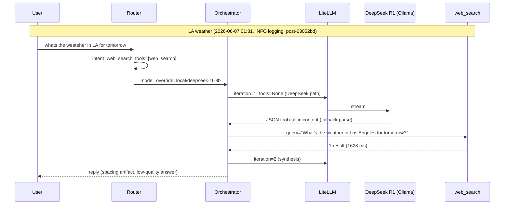
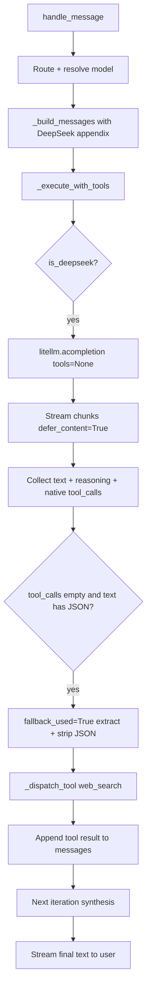

# DeepSeek R1 — LA Weather Turn & Post-1am Formatting Regression (2026-06-07)

Analysis of live chat turns in the `home` project on **2026-06-07 after 01:00 local** (08:00 UTC). Primary case study: a `local/deepseek-r1-8b` override on a `web_search` query at 01:31. Broader finding: **4 of 5 post-1am turns** produced assistant replies with **all inter-word spaces missing** in persisted `messages.json` — affecting both DeepSeek R1 and Kimi K2.

**Generated:** 2026-06-07  
**Primary log:** `logs/prompter.log`  
**Primary thread:** `projects/home/.prompter/threads/thread-1780821054-737497/messages.json`

All turns occurred **after** commit `63052bd` (2026-06-07 01:28:56), which routes DeepSeek R1 through appendix-based JSON tool instructions and omits `tools=` from LiteLLM so `reasoning_content` is preserved in the stream.

---

## Summary

| Field | Value |
|-------|-------|
| Scope | 5 user turns on 2026-06-07 after 01:00 local (all same query) |
| Formatting regression | **4 / 5** assistant replies have **zero spaces** between words in persisted content |
| Models affected | `local/deepseek-r1-8b` (1 bad, 1 good) and `remote/kimi-k2-6` (3 bad) |
| Intent (all turns) | `web_search` |
| Iteration pattern | Tool call in iteration 1 succeeded in all cases; spacing failure appears in **iteration 2 synthesis** output |
| Primary case study | 01:31 LA weather turn — DeepSeek override, 1 search result, concatenated final reply |

The 01:31 turn is a **partial success**: the orchestrator parsed a JSON tool call, executed `web_search`, and completed a synthesis pass. The final answer was low quality and exhibited a streaming reassembly artifact (concatenated words). Subsequent re-tests of the same query (01:36–01:39) show the spacing defect is **cross-model and mostly cross-turn**, not isolated to DeepSeek R1.

---

## Log Sources

| Path | Notes |
|------|-------|
| `logs/prompter.log` | INFO-level entries for 2026-06-07 01:30:45–01:39:07 (5 turns) |
| `projects/home/.prompter/threads/thread-1780821054-737497/messages.json` | Primary case study (01:31, DeepSeek, bad formatting) |
| `projects/home/.prompter/threads/thread-1780821410-978649/messages.json` | 01:36 DeepSeek re-test (good formatting) |
| `projects/home/.prompter/threads/thread-1780821454-288425/messages.json` | 01:37 Kimi (bad formatting) |
| `projects/home/.prompter/threads/thread-1780821500-486591/messages.json` | 01:38 Kimi (bad formatting) |
| `projects/home/.prompter/threads/thread-1780821539-536823/messages.json` | 01:39 Kimi (bad formatting) |

No DEBUG response line or SSE trace was captured for this session (logging configured at INFO at 01:30:45).

---

## Timeline



### `logs/prompter.log` excerpts

```
2026-06-07 01:30:45 | prompter | Logging configured: level=INFO file=True
2026-06-07 01:31:18 | prompter.router | Classifier decision {"input": "whats the weateher in LA for tomorrow", "intent": "web_search", "tools": ["web_search"], "confidence": 0.0, "latency_ms": 907.29}
2026-06-07 01:31:18 | prompter.router | Routing decision {"input": "whats the weateher in LA for tomorrow", "matched_layer": "classifier", "intent": "web_search", "tools": ["web_search"], "model": "remote/kimi-k2-6", "source": "classifier", "confidence": 0.0}
2026-06-07 01:31:18 | prompter.router | model_override applied: local/deepseek-r1-8b (intent=web_search)
2026-06-07 01:31:18 | prompter.llm     | LiteLLM completion alias=local/deepseek-r1-8b model=ollama/deepseek-r1:8b iteration=1
2026-06-07 01:31:25 | prompter.mcp     | Dispatch tool name=web_search arguments={"query": "What's the weather in Los Angeles for tomorrow?", "max_results": 1}
2026-06-07 01:31:25 | prompter.mcp     | web_search query="What's the weather in Los Angeles for tomorrow?" max_results=1
2026-06-07 01:31:25 | prompter.search  | Search query="What's the weather in Los Angeles for tomorrow?" max_results=1
2026-06-07 01:31:27 | prompter.search  | Search query="What's the weather in Los Angeles for tomorrow?" returned 1 result(s) in 1628.1ms
2026-06-07 01:31:27 | prompter.llm     | LiteLLM completion alias=local/deepseek-r1-8b model=ollama/deepseek-r1:8b iteration=2
```

**Timing:** iteration 1 ran ~7.1 s (01:31:18 → 01:31:25); search + iteration 2 start ~1.6 s later. Assistant message persisted at `2026-06-07T08:31:33Z` (~6 s after iteration 2 began).

### Persisted thread `thread-1780821054-737497`

```json
{
  "role": "user",
  "content": "whats the weateher in LA for tomorrow",
  "created_at": "2026-06-07T08:31:18.593207+00:00"
}
```

```json
{
  "role": "assistant",
  "content": "Thedocumentsdonotcontainenoughinformationtodeterminethespecificdetailsabouttomorrow'sweatherinLosAngeles.Ihaveperformedawebsearch,buttheretrievedcontentdoesnotprovideanactualforecastortemperaturepredictionsfortomorrow.",
  "created_at": "2026-06-07T08:31:33.020490+00:00",
  "model": "local/deepseek-r1-8b"
}
```

Tool execution succeeded; synthesis (iteration 2) produced a reply with **concatenated words (no spaces)** and did not surface useful forecast data despite a search result being returned.

---

## Orchestrator Flow

Relevant code: `app/chat_orchestrator.py`

### Routing

1. Classifier assigned `intent=web_search`, `tools=["web_search"]`, recommended model `remote/kimi-k2-6` (`confidence: 0.0`).
2. **`model_override=local/deepseek-r1-8b`** bypassed the recommended remote model.
3. Orchestrator emitted SSE `{"type": "routed", "model": "local/deepseek-r1-8b", "intent": "web_search"}`.

### `_build_messages`

For DeepSeek R1 aliases, `_format_tool_instructions()` selects `_format_deepseek_tool_appendix()` instead of the generic `_format_tool_appendix()`. The system prompt includes:

- Tool enablement list
- Explicit JSON-only tool call format (`{"name":"...","arguments":{...}}`)
- Instruction to finish reasoning first, then output JSON with no markdown fences
- Per-tool parameter reference

Project instructions from `home` are appended under `## Project instructions`.

### `_execute_with_tools` — behaviors relevant to this turn

| Mechanism | Behavior for DeepSeek R1 |
|-----------|--------------------------|
| `is_deepseek` | Detected via `_is_deepseek_r1_model()` on alias / resolved model |
| `_api_tool_schemas` | **`None`** — `tools=` omitted from `litellm.acompletion()` |
| `active_tool_schemas` | **Still set** — keeps fallback parser enabled |
| `defer_content` | `True` when tools active or DeepSeek — chunks buffered until post-parse |
| Reasoning capture | `reasoning_content` / `thinking` deltas accumulated in `reasoning_buffer` |
| `_strip_deepseek_reasoning` | Removes `...` from text buffer |
| Fallback | `_extract_tool_calls_from_text()` parses JSON (or fenced JSON) from `content` |
| Tool loop | Appends assistant message with synthetic `tool_calls`, dispatches via MCP, continues to iteration 2+ |



---

## DeepSeek Model Behavior (this turn)

INFO-level logging did not capture iteration-1 response fields (`text`, `reasoning`, `tool_calls`, `fallback_used`). Inferred behavior from downstream evidence:

| Observation | Evidence |
|-------------|----------|
| Model emitted a parseable tool call | MCP dispatch at 01:31:25 with `web_search` and corrected query text |
| Native `tool_calls` absent | No `tool_calls` logged; dispatch implies text-JSON fallback path |
| ~7 s iteration-1 latency | Consistent with reasoning + JSON output path (not the sub-second LiteLLM+`tools=` fast path) |
| Synthesis spacing artifact | Persisted assistant `content` has no spaces between words |

The model corrected the user's typo ("weateher") and informal "LA" to a well-formed search query: `"What's the weather in Los Angeles for tomorrow?"`.

---

## Tool Calling

Evidence from `prompter.log`:

```
Dispatch tool name=web_search arguments={"query": "What's the weather in Los Angeles for tomorrow?", "max_results": 1}
Search ... returned 1 result(s) in 1628.1ms
```

The orchestrator successfully:

1. Parsed a JSON tool call from model output (native `tool_calls` absent — inferred from MCP dispatch following iteration 1).
2. Executed `web_search` via MCP.
3. Started iteration 2 for synthesis.

`fallback_used` is not logged at INFO level, but tool dispatch confirms fallback or equivalent parsing succeeded.

### Fallback parser (relevant capabilities)

`_extract_tool_calls_from_text` accepts:

- Raw JSON object in text
- Fenced ` ```json ... ``` ` blocks
- `{"name": "...", "arguments": {...}}` or nested `{"function": {...}}` shapes

After extraction, `_strip_tool_json_from_text` removes JSON from streamed user-visible content.

---

## Issues and Observations

1. **Tool call path worked post-`63052bd`:** Search dispatched and returned 1 result. The appendix + text-JSON fallback integration path functioned for this turn.

2. **Spacing artifact:** Persisted assistant text lacks spaces between words (`Thedocumentsdonot...`). Suggests a streaming reassembly issue in iteration 2 synthesis, not a search failure.

3. **Answer quality:** Search returned 1 result in 1.6 s, but the model claimed documents/search did not contain forecast details. Possible causes: weak snippet in search result, synthesis prompt not emphasizing tool output, or model conservatism from project instructions ("Say when the documents do not contain enough information").

4. **Classifier confidence 0.0:** Routing still selected `web_search` correctly despite zero confidence.

5. **INFO logging gap:** No iteration-1 response detail or `fallback_used` flag captured. A DEBUG re-run would confirm reasoning buffer contents and exact parse path.

---

## Cross-chat formatting issues (2026-06-07 after 01:00)

### Scope and method

Searched all evidence from **2026-06-07 01:00:00 local** onward (08:00 UTC):

| Source | Filter | Result |
|--------|--------|--------|
| `logs/prompter.log` | Lines timestamped `2026-06-07 01:00+` | 46 log lines covering 5 distinct chat turns (01:31–01:39) |
| `projects/home/.prompter/threads/*/messages.json` | `created_at >= 2026-06-07T08:00:00+00:00` | 5 user + 5 assistant messages across 5 threads |
| Other projects | Same timestamp filter | No additional threads found |

All five turns used the **same user query**: `"whats the weateher in LA for tomorrow"`. All were classified as `web_search`. No DEBUG-level LLM response text or SSE trace was captured (logging at INFO since 01:30:45).

### Turn inventory

| # | Local time | Thread | Model | Intent | Iter 1 tool | Iter 2 notes | Formatting |
|---|------------|--------|-------|--------|-------------|--------------|------------|
| 1 | 01:31:18 | `thread-1780821054-737497` | `local/deepseek-r1-8b` (override) | `web_search` | `web_search` (1 result) | synthesis ~6 s | **BAD** — 0 spaces |
| 2 | 01:36:58 | `thread-1780821410-978649` | `local/deepseek-r1-8b` (override) | `web_search` | `web_search` (5 results) | synthesis ~6 s | **OK** — normal spacing |
| 3 | 01:37:37 | `thread-1780821454-288425` | `remote/kimi-k2-6` (auto-routed) | `web_search` | `web_search` (5 results) | warning: tools after tool round | **BAD** — 0 spaces |
| 4 | 01:38:44 | `thread-1780821500-486591` | `remote/kimi-k2-6` (auto-routed) | `web_search` | `web_search` (5 results) | warning: tools after tool round | **BAD** — 0 spaces |
| 5 | 01:39:02 | `thread-1780821539-536823` | `remote/kimi-k2-6` (auto-routed) | `web_search` | `web_search` (5 results) | warning: tools after tool round | **BAD** — 0 spaces |

**Total post-1am chats:** 5  
**With formatting defect in persisted assistant content:** 4 (80%)

### Formatting defect — confirmed in logs and persisted messages

**Symptom:** Assistant replies read as one continuous token run — no spaces between words. Punctuation, apostrophes, commas, and markdown markers (`**bold**`) are preserved; only word-boundary spaces are absent.

**Detection heuristic:** Persisted `content` fields with long alphabetic runs (15+ chars) and **zero space characters** despite 200–580 char length.

#### Turn 1 — DeepSeek R1, BAD (01:31)

Persisted (`thread-1780821054-737497`):

```json
{
  "role": "assistant",
  "content": "Thedocumentsdonotcontainenoughinformationtodeterminethespecificdetailsabouttomorrow'sweatherinLosAngeles.Ihaveperformedawebsearch,buttheretrievedcontentdoesnotprovideanactualforecastortemperaturepredictionsfortomorrow.",
  "model": "local/deepseek-r1-8b"
}
```

- Character count: 218 | Space count: **0**

#### Turn 2 — DeepSeek R1, OK (01:36)

Persisted (`thread-1780821410-978649`):

```json
{
  "role": "assistant",
  "content": "Tomorrow's weather forecast in Los Angeles will depend on the current conditions and meteorological models. A web search can provide more specific details like temperature range, precipitation chance, wind speed, etc.\n\n**Possible tomorrow weather highlights based on recent forecasts:**\n\n*   Generally sunny skies are expected throughout most of the day.\n*   Temperatures typically warm up during the afternoon but cool down in the evening.\n\nFor a detailed and specific forecast for tomorrow, please check an official weather service website after performing a web search.",
  "model": "local/deepseek-r1-8b"
}
```

- Character count: 572 | Space count: **83** — normal prose and markdown.

#### Turns 3–5 — Kimi K2, BAD (01:37–01:39)

Persisted excerpt (`thread-1780821454-288425`, 01:37):

```
Thesearchresultsdon'tincludethespecificforecastdetailsfortomorrow(suchashigh/lowtemperatures,conditions,orchanceofrain).Theyonlypointtoforecastpages...
```

Persisted excerpt (`thread-1780821500-486591`, 01:38):

```
Thesearchresultsdon'tcontainthespecificforecastdetailsfortomorrow(temperature,conditions,orchanceofrain).IcanseelinkstoweatherserviceslikeAccuWeather,Weather.com,andWeatherUnderground...
```

Persisted excerpt (`thread-1780821539-536823`, 01:39):

```
Basedonthesearchresults,tomorrow'sweatherinLosAngelesisexpectedtobe**pleasant**with**noprecipitationexpected**and**lightwindsfromthesoutheast**...
```

All three Kimi replies: space count **0** in persisted JSON.

#### Log excerpts — Kimi iteration-2 tool re-request

All three Kimi turns logged this warning during iteration 2:

```
2026-06-07 01:37:45,054 | prompter.llm | WARNING | Model requested tools after tool round; ignoring alias=remote/kimi-k2-6 iteration=2
2026-06-07 01:38:50,458 | prompter.llm | WARNING | Model requested tools after tool round; ignoring alias=remote/kimi-k2-6 iteration=2
2026-06-07 01:39:07,690 | prompter.llm | WARNING | Model requested tools after tool round; ignoring alias=remote/kimi-k2-6 iteration=2
```

DeepSeek turns did **not** log this warning.

### Patterns observed

| Pattern | Confirmed? | Notes |
|---------|------------|-------|
| Affects all post-1am chats | **No** — 4/5 | One DeepSeek re-test (01:36) produced correctly spaced output |
| DeepSeek R1 only | **No** | 3/3 Kimi K2 synthesis replies also affected |
| Iteration 1 (tool-call pass) | **No visible defect** | Tool calls parsed and dispatched successfully in all 5 turns; defect appears only in final user-facing synthesis text |
| Iteration 2 (post-tool synthesis) | **Yes** | All bad replies are iteration-2 answers; iteration-1 outputs are JSON tool calls (not persisted as assistant content) |
| Correlation with `defer_content` | **Mixed** | DeepSeek uses `defer_content=True` on all iterations (`is_deepseek`); Kimi uses per-delta streaming on iteration 2 (`defer_content=False`). Both paths can produce bad output |
| Correlation with Kimi tool re-request | **Partial** | All 3 bad Kimi turns logged "tools after tool round"; the 1 good DeepSeek turn did not. Not sufficient to explain the 01:31 bad DeepSeek turn |
| Persisted == streamed | **Yes (inferred)** | `handle_message()` persists `"".join(reply_parts)` — same chunks sent via SSE. Defect is in backend assembly, not frontend-only display |
| Search quality / answer content | Separate issue | Bad turns also give low-quality "can't find forecast" answers, but spacing defect is independent (formatting broken even when markdown `**` markers present) |

### Confirmed vs suspected cause

#### Confirmed in logs / persisted data

1. **Four of five** post-1am assistant messages have **literally zero space characters** in persisted `content`.
2. Defect spans **both** `local/deepseek-r1-8b` and `remote/kimi-k2-6`.
3. All affected turns completed the tool loop (iteration 1 dispatch + iteration 2 synthesis).
4. Final text is assembled in `handle_message()` via `reply_parts.append(...)` then `"".join(reply_parts)` before `append_message()` — the garbled string is what the orchestrator accumulated, not a persistence-layer mutation.
5. No application code explicitly strips spaces from assistant text (no `replace(" ", ...)` in orchestrator).

#### Suspected cause (requires DEBUG re-run to confirm)

Primary hypothesis: **stream delta concatenation loses word-boundary spaces** when building `reply_parts`.

Relevant orchestrator paths (`app/chat_orchestrator.py`):

```python
# handle_message — final persistence
reply_parts.append(parsed.get("content", ""))  # per SSE chunk
...
self.projects.append_message(..., "".join(reply_parts), ...)
```

**Kimi iteration 2** (`defer_content=False`): each `delta.content` is yielded immediately:

```847:866:app/chat_orchestrator.py
defer_content = bool(active_tool_schemas) or is_deepseek
...
if delta.content:
    text_buffer += delta.content
    if not defer_content:
        yield json.dumps({"type": "chunk", "content": delta.content})
```

If the provider/LiteLLM stream emits word tokens without leading spaces on chunk boundaries, `"".join(reply_parts)` produces exactly the observed `Thesearchresults...` pattern.

**DeepSeek iteration 2** (`defer_content=True`): deltas are buffered in `text_buffer` and emitted as one chunk at line 919–920. The same `text_buffer += delta.content` concatenation applies — a single-chunk emit still reflects the same missing-space assembly. This explains why the 01:31 DeepSeek turn is bad despite the deferred path.

Secondary hypotheses (lower confidence):

- **`reasoning_content` vs `content` field mix-up** on DeepSeek R1 — reasoning deltas go to `reasoning_buffer`, but if synthesis prose leaks into the wrong field or inline `` blocks interact with `_strip_deepseek_reasoning`, spacing could be affected. No direct evidence at INFO level.
- **`_strip_tool_json_from_text`** on iteration 2 when Kimi re-requests tools (line 914) — modifies `text_buffer` after streaming, but streamed chunks were already sent raw; unlikely to explain persisted content unless only the buffer path contributed (it doesn't for Kimi iter 2).
- **Model-side output** — less likely for Kimi K2 (normally well-formatted), but cannot rule out without DEBUG `llm_response` traces showing raw `text_buffer`.

Recommended next step: re-run one affected turn with **DEBUG logging** and/or SSE trace enabled to capture per-chunk `delta.content` previews and final `text_buffer` before persistence.

---

## Related Code Context

Commit `63052bd` (`feat(chat-orchestrator): fix DeepSeek R1 appendix-based tool calling`, 2026-06-07 01:28:56) landed ~2 minutes before this turn:

| Change | Purpose |
|--------|---------|
| `_format_deepseek_tool_appendix()` | DeepSeek-specific system prompt with JSON tool call contract |
| `_api_tool_schemas = None if is_deepseek else active_tool_schemas` | Omit `tools=` from LiteLLM for DeepSeek R1 |
| `active_tool_schemas` kept non-None | Ensures text-JSON fallback still runs |

This turn is the first logged live validation of that fix on a `web_search` query.

---

## Appendix: Classifier and Override Log Excerpt

```json
{"input": "whats the weateher in LA for tomorrow", "intent": "web_search", "tools": ["web_search"],
 "model": "remote/kimi-k2-6", "source": "classifier", "confidence": 0.0}
```

```
model_override applied: local/deepseek-r1-8b (intent=web_search)
```
