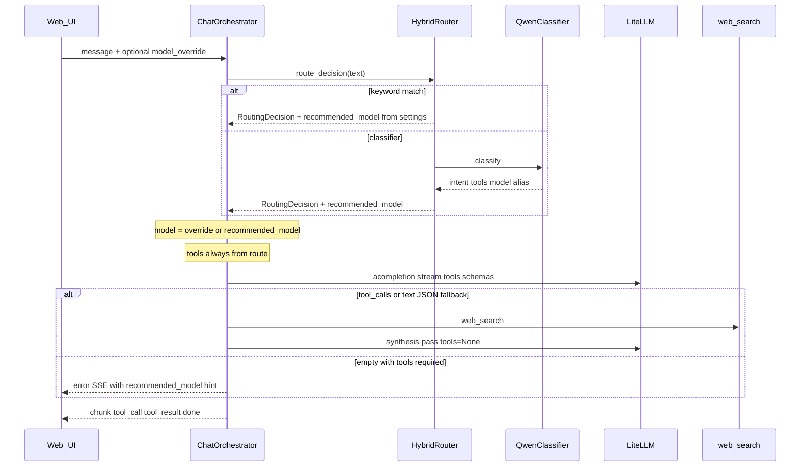

# Branch Handoff: `phase1/classifier-model-override`

**Audience:** Claude or any agent picking up this work cold.  
**Branch:** `phase1/classifier-model-override`  
**Merge base with `main`:** `e92a646` (`fix(orchestrator): surface error when model skips required tools`)  
**HEAD (as of 2026-06-07):** `9f1a45d` (`revert(orchestrator): undo DeepSeek wait-then-parse experiment`)  
**Status:** Classifier model routing and override semantics are **in**. DeepSeek R1 tool-calling fix path was **tried and reverted**. Problem remains **unresolved** — see [deepseek-tool-calling-investigation.md](./deepseek-tool-calling-investigation.md).

---

## 1. Why this branch exists

Users can set a **model override** in the UI (e.g. `local/deepseek-r1-8b`) while the classifier still picks **intent and tools** (e.g. `web_search`). Two problems drove this branch:

1. **Routing gap:** The classifier prompt already asked for a `model` field in JSON, but the app ignored it and always used `settings.json` per-intent defaults.
2. **Silent failures:** When a model skipped required tools or returned `{}`, the UI showed an empty reply with no explanation.

A parallel thread investigated **DeepSeek R1 8B + web_search** failing on Ollama (empty ~800ms streams). That fix experiment was **reverted**; investigation docs and a diagnostic script remain locally.

---

## 2. Commit timeline (newest first)

| Commit | Summary | Net effect today |
|--------|---------|------------------|
| `9f1a45d` | **Revert** `cb5d202` | Restored orchestrator/tests to pre–DeepSeek-experiment behavior |
| `d4b9275` | Safety snapshot | Docs, reasoning UI wiring, cursor rules, `uv.lock`, README — **still active** |
| `cb5d202` | DeepSeek wait-then-parse | **Reverted** — see §7 |
| `876c41e` | Generic assistant prompt + tool appendix | **Active** — shorter base prompt, stronger tool instructions |
| `4e71876` | Classifier model → routing | **Active** — core branch feature |
| *(base)* `e92a646` | Tool-skip error surfacing | **Active** — started on main lineage before branch commits |

---

## 3. What is active on this branch (after revert)

### 3.1 Classifier-recommended model (`4e71876`)

**Files:** `app/router.py`, `app/adapters/classifier_qwen.py`, `app/chat_orchestrator.py`, `app/config.py`, tests.

- Classifier JSON may include `"model": "<litellm alias>"` (e.g. `remote/kimi-k2-6`).
- `QwenClassifierAdapter._validate_model_alias()` checks the alias exists in `litellm_config.yaml`; invalid/missing → `None`.
- New frozen dataclass `RoutingDecision` replaces bare `RouteResult` for full routing path:
  - `intent`, `tools`, `confidence`, `source`, **`recommended_model`**
- Keyword rules set `recommended_model = resolve_model(intent)` from `settings.json`.
- Classifier path uses `_classifier_recommended_model()` — classifier `model` if valid, else intent default.

**Override semantics (agreed design):**

| Field | Source when override set | Source when no override |
|-------|--------------------------|-------------------------|
| LLM alias | User `model_override` | `decision.recommended_model` |
| Intent | Route (keyword/classifier) | Route |
| Tools | Route | Route |

SSE `routed` event now includes `recommended_model` and `model_override` (bool).

### 3.2 Context-aware tool-skip errors (`e92a646` + `4e71876`)

**File:** `app/chat_orchestrator.py` — `_tools_required_error()`

When tools are required but the model returns empty text and no tool calls:

- If **override active:** message names override alias, required tools, intent, and **classifier-recommended model** to try instead.
- If **no override:** message names selected model and recommended model.

No auto-fallback to recommended model — user must clear override or pick another model.

### 3.3 Generic system prompt + tool appendix (`876c41e`)

**Files:** `app/config.py`, `app/chat_orchestrator.py`

- `DEFAULT_ASSISTANT_PROMPT` shortened to a minimal project-aware assistant (no tool prose in base prompt).
- `_format_tool_appendix(tools)` appended to system message when route has tools:
  - Strong “MUST call tools” language
  - Instructs **native structured `tool_calls`**, not plain JSON in reply
  - Per-tool parameter schema lines via `_format_tool_parameter_lines()`

**Note:** This generic appendix tells models to use OpenAI `tool_calls`. DeepSeek R1 on Ollama often does **not** — tension documented in investigation doc. There is **no** DeepSeek-specific appendix in current code (that was in reverted `cb5d202`).

### 3.4 Classifier prompt expansion (`876c41e` / config)

**File:** `app/config.py` — `DEFAULT_CLASSIFIER_PROMPT`

- Rich intent boundaries (web_search vs general_chat vs file_ops, etc.).
- Explicit `model` in output schema with per-intent examples (e.g. web_search → `remote/kimi-k2-6`).
- Tools map and valid tool names enumerated.

Local `settings.json` (gitignored) may override; defaults live in code.

### 3.5 Frontend: reasoning UI (`d4b9275`) — partial wiring

**Files:** `web/src/api/client.ts`, `web/src/components/ChatView.tsx`, `web/src/components/MessageBubble.tsx`

- `SseEvent` includes `{ type: "reasoning"; content: string }`.
- ChatView accumulates `reasoning` on streaming messages; MessageBubble shows collapsible **“Model reasoning”**.

**Gap:** After revert of `cb5d202`, **`ChatOrchestrator` does not emit `type: "reasoning"` SSE events**. Reasoning is still parsed internally for tool-json fallback and debug traces (`llm_reasoning` debug event when `sse_trace` enabled), but the UI path is **dormant** unless something else emits `reasoning` chunks.

### 3.6 Docs and repo hygiene (`d4b9275`)

| Path | Purpose |
|------|---------|
| [deepseek-tool-calling-investigation.md](./deepseek-tool-calling-investigation.md) | Full DeepSeek/Ollama tool investigation handoff |
| `docs/old/` | Archived `phase1-open-bugs.md`, `phase1-search-ddg-resilience.md`, `PROMPT_LOGGING_DEBUG.md` |
| `README.md` | Testing / dev notes (+88 lines) |
| `.cursor/rules/000-git-precedence.mdc` | Scoped-task commit precedence |
| `.cursor/rules/008-git-discipline.mdc` | Parallel agent git workflow |
| `uv.lock` | Lockfile added (2956 lines) |
| `AGENTS.md` | Minor pointer update |

---

## 4. What was tried and reverted (`cb5d202` → `9f1a45d`)

Commit `cb5d202` attempted to fix DeepSeek R1 tool calling. It was **reverted** because production still saw **empty streams** (~826ms, zero content/reasoning/tool_calls) — not a parsing timing issue.

**Reverted behavior included:**

- `_format_deepseek_tool_appendix()` — JSON-only tool instructions for R1
- `_is_deepseek_r1_model()` detection
- `think=True` passed to LiteLLM when DeepSeek + active tool schemas
- `defer_content` / wait-for-full-stream before failing
- Broader parsers (`parameters` alias, redacted tool tokens, `"let"` field coercion)
- Streaming `type: "reasoning"` SSE to the UI
- Additional DeepSeek-specific tests

**Do not re-apply blindly.** Read investigation doc and run diagnostic script first.

---

## 5. DeepSeek R1 problem (still open)

**Symptom:** User override `local/deepseek-r1-8b` + `web_search` intent → instant error or silence; logs show `tool_calls=[]`, empty text, ~800ms LLM time.

**Works:** `remote/kimi-k2-6`, `local/qwen2.5-coder-7b` (text JSON fallback).

**Hypotheses (from investigation + diagnostic runs):**

- Ollama `tools=` may destabilize DeepSeek R1 template
- LiteLLM streaming drops Ollama `thinking`
- Model outputs non–OpenAI-format JSON instead of `tool_calls`
- Empty stream is not “didn’t wait long enough” — zero bytes received

**Local diagnostic (untracked):** `scripts/test_deepseek_tool_diagnosis.py`  
Runs 12 cases × 2 passes (think off/on), writes `logs/deepseek_diagnosis_think_*.log` and `.md`. On one dev machine run, **no empty cases** — environment variance is real.

---

## 6. Request flow (current)



---

## 7. Files changed vs `main` (net, after revert)

```
 .cursor/rules/000-git-precedence.mdc
 .cursor/rules/001-base.mdc
 .cursor/rules/006-no-scope-creep.mdc
 .cursor/rules/008-git-discipline.mdc
 AGENTS.md
 README.md
 app/adapters/classifier_qwen.py      (+ model validation)
 app/chat_orchestrator.py             (+ routing, appendix, errors; - DeepSeek experiment)
 app/config.py                        (+ classifier prompt, assistant prompt)
 app/router.py                        (+ RoutingDecision, recommended_model)
 docs/deepseek-tool-calling-investigation.md
 docs/old/...
 tests/test_chat_orchestrator.py
 tests/test_classifier_qwen.py
 tests/test_router.py
 uv.lock
 web/src/api/client.ts
 web/src/components/ChatView.tsx
 web/src/components/MessageBubble.tsx
```

**21 files, ~4280 insertions / ~170 deletions** vs merge base (mostly `uv.lock` + investigation doc).

---

## 8. Untracked local artifacts (not committed)

| Path | Notes |
|------|-------|
| `scripts/test_deepseek_tool_diagnosis.py` | Standalone httpx/litellm 12-case matrix |
| `logs/deepseek_diagnosis_think_*.log/.md` | Diagnostic output |
| `.pytest-tmp/` | Ad-hoc probes |
| `nul` | Windows artifact — ignore/delete |

---

## 9. Tests

Relevant suites (last run on revert):

```bash
pytest tests/test_chat_orchestrator.py -q   # 24 passed
pytest tests/test_router.py tests/test_classifier_qwen.py -q
```

Branch adds/updates tests for:

- `recommended_model` on keyword and classifier routes
- Override keeps route tools; error messages mention recommended model
- Classifier `model` alias validation against `litellm_config.yaml`
- Tool appendix content in system messages

DeepSeek-specific tests from `cb5d202` were **removed** by revert.

---

## 10. Config reference

**`litellm_config.yaml`** — unchanged on branch; DeepSeek alias:

```yaml
- model_name: local/deepseek-r1-8b
  litellm_params:
    model: ollama/deepseek-r1:8b
    api_base: http://localhost:11434
```

**`settings.json`** (local, gitignored) — user may set `general_chat: local/deepseek-r1-8b`, making DeepSeek the default for general chat while classifier still recommends `remote/kimi-k2-6` for web_search.

---

## 11. Suggested next steps for Claude

1. **Read** [deepseek-tool-calling-investigation.md](./deepseek-tool-calling-investigation.md) §6 (latest failure evidence) and §13 (open questions).
2. **Run** `python scripts/test_deepseek_tool_diagnosis.py` with Ollama + `deepseek-r1:8b` pulled; compare think_off vs think_on cross-pass diff.
3. **Decide policy:** block/warn DeepSeek override when tools required? Or fix at Ollama/template/LiteLLM layer?
4. **Wire or drop** reasoning UI — either emit `reasoning` SSE from orchestrator again (with a working path) or remove dead frontend types.
5. **Merge readiness:** Core routing feature (`4e71876`, `876c41e`, `e92a646`) is separable from DeepSeek work; snapshot commit `d4b9275` mixes docs/UI/lockfile — consider splitting before PR.

---

## 12. Key symbols (quick index)

| Symbol | File | Role |
|--------|------|------|
| `RoutingDecision` | `app/router.py` | Full route + `recommended_model` |
| `_classifier_recommended_model()` | `app/router.py` | Classifier model or intent fallback |
| `_validate_model_alias()` | `app/adapters/classifier_qwen.py` | Validates classifier `model` field |
| `_tools_required_error()` | `app/chat_orchestrator.py` | User-facing tool-skip error |
| `_format_tool_appendix()` | `app/chat_orchestrator.py` | Generic native tool_calls instructions |
| `_extract_tool_calls_from_text()` | `app/chat_orchestrator.py` | Text JSON fallback (qwen path) |
| `DEFAULT_CLASSIFIER_PROMPT` | `app/config.py` | Classifier system prompt with model examples |
| `TOOL_SCHEMA` | `app/tools/web_search.py` | OpenAI-format web_search definition |

---

## 13. Git commands

```bash
git checkout phase1/classifier-model-override
git log main..HEAD --oneline
git diff main...HEAD --stat
```

To inspect the reverted experiment without checking it out:

```bash
git show cb5d202
git show 9f1a45d
```
